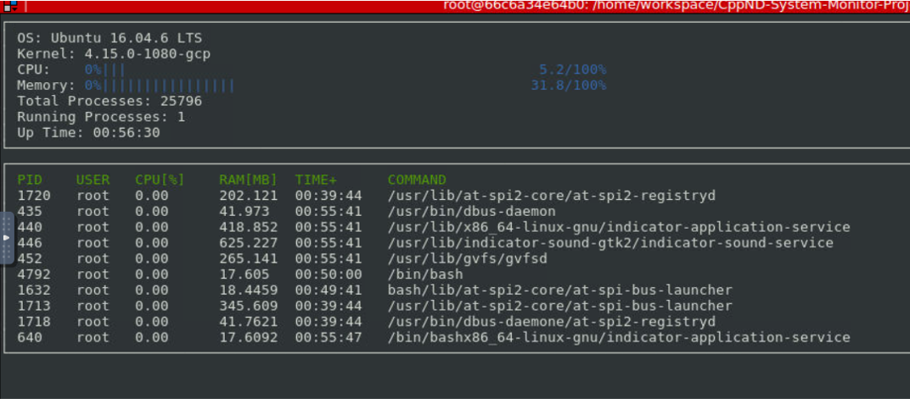

# CppND-System-Monitor

My solution of the System Monitor Project in the Object Oriented Programming Course of the Udacity C++ Nanodegree program.

The project concerns a system monitor for the Linux Operating System and emphasized learnings from the Object Oriented Programming (OOP) course of the program.

The base code can be found here https://github.com/udacity/CppND-System-Monitor

# ncurses
ncurses is a library that facilitates text-based graphical output in the terminal. This project relies on ncurses for display output.

Install ncurses within your own Linux environment: sudo apt install libncurses5-dev libncursesw5-dev

# Make
This project uses Make. The Makefile has four targets:

- build compiles the source code and generates an executable
- format applies ClangFormat to style the source code
- debug compiles the source code and generates an executable, including debugging symbols
- clean deletes the build/ directory, including all of the build artifacts

# Instructions
First, make sure you have installed ncurses, which is a library that facilitates text-based graphical output in the terminal. This project relies on ncurses for display output. You can install ncurses within your own Linux environment: sudo apt install libncurses5-dev libncursesw5-dev

Clone the project repository: git clone https://github.com/konstantink36/Udacity-SystemMonitor.git

Build the project: make build

Run the resulting executable: ./build/monitor
